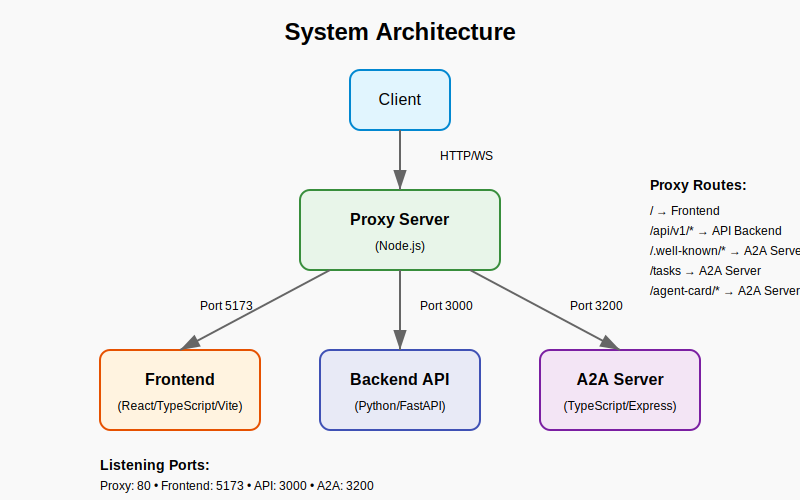

# Multi-Component System with A2A Server Integration

This project is a scalable, multi-component system built with modern web technologies.

## Architecture Overview

The system consists of several decoupled components that work together:

1. **Frontend**: React/TypeScript application with Material-UI, built using Vite
2. **Backend API**: Python/FastAPI service providing API endpoints
3. **Proxy Server**: Node.js proxy that routes requests to the appropriate services
4. **A2A Server**: Agent-to-Agent server implementation following the A2A specification



## Components

### Frontend

- Modern React application with TypeScript
- Material-UI for component styling
- State management with Zustand
- Responsive dashboard UI

### Backend API

- FastAPI (Python) backend
- Health check endpoints
- Data processing services

### Proxy Server

- Node.js-based reverse proxy
- Routes requests to appropriate services:
  - Frontend requests → Vite development server
  - API requests → FastAPI backend
  - A2A requests → A2A server
- WebSocket support for real-time communication

### A2A Server

- Implementation of the [A2A specification](https://github.com/ai-agents/a2a)
- Enables agent-to-agent communication
- Provides task management and messaging capabilities
- Supports both direct requests and streaming updates

## A2A Server Integration

The A2A server is integrated with the main application via the proxy server. Requests to the following endpoints are routed to the A2A server:

- `/.well-known/agent.json`: Agent information and capabilities
- `/tasks`: Task management endpoint for JSON-RPC requests

See the [A2A server documentation](./a2a-server/README.md) for more details on implementation and usage.

## Development

### Prerequisites

- Node.js 20+
- Python 3.11+
- npm or yarn

### Running the Application

The application is divided into multiple services, each running in its own process:

1. **API Backend**:
   ```
   cd api
   pip install -r requirements.txt
   python main.py
   ```

2. **Frontend Development Server**:
   ```
   cd frontend
   npm install
   npm run dev
   ```

3. **Proxy Server**:
   ```
   node proxy-server.js
   ```

4. **A2A Server**:
   ```
   cd a2a-server
   node simple-server.js  # JavaScript implementation
   # or for TypeScript implementation (if compiled)
   # node dist/main.js
   ```

### Running Tests

Integration tests are available for the A2A server:

```
cd tests
node run-tests.js  # Runs all A2A server tests
```

## API Endpoints

### Backend API

- `GET /v1/health`: Health check endpoint

### A2A Server

- `GET /.well-known/agent.json`: Agent card information
- `POST /tasks`: JSON-RPC endpoint for task operations:
  - `tasks/send`: Send a message to the agent
  - `tasks/sendSubscribe`: Send a message with streaming updates
  - `tasks/get`: Get task information by ID
  - `tasks/cancel`: Cancel a running task